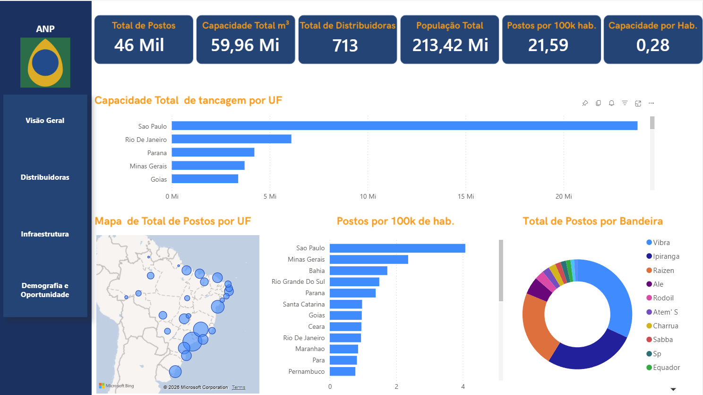

# ⛽ Projeto Analítico ANP - Pipeline de Dados e BI


Bem-vindo ao repositório do projeto **AnaliseANP**. Este projeto foi desenvolvido como parte de um desafio prático de Engenharia de Dados e Business Intelligence, focado no processamento ponta a ponta de dados do setor de combustíveis utilizando informações públicas da **Agência Nacional do Petróleo, Gás Natural e Biocombustíveis (ANP)**.

---

## 🎯 Objetivo do Projeto

Construir uma solução de dados completa, desde a ingestão até a geração de insights, englobando extração, tratamento, modelagem dimensional e armazenamento, culminando em um dashboard analítico. O projeto visa mapear a infraestrutura do setor de combustíveis (Postos, Distribuidoras e Tancagem) e cruzar com dados populacionais para enriquecimento analítico.

---

## 🏗️ Arquitetura da Solução

O pipeline de dados foi desenhado seguindo uma arquitetura *batch* baseada em scripts Python e banco de dados relacional:

1. **Extração (Ingestion):** Scripts Python (`download.py` e `BrasilAPI.py`) realizam o download direto dos arquivos CSV da ANP e consomem a Brasil API para buscar dados demográficos do IBGE, salvando os arquivos na camada `raw`.
2. **Transformação (Processing):** O script `limpeza.py` lê os dados brutos, realiza inspeção estrutural dinâmica (identificando delimitadores e encodings), padroniza cabeçalhos, remove caracteres especiais e formata documentos (CNPJ), salvando o resultado na camada `trusted`.
3. **Carga e Modelagem (Load & Modeling):** O script `load.py` conecta-se a um banco PostgreSQL via Docker, carrega os dados limpos em tabelas *staging* e executa queries SQL estruturais para construir o modelo analítico (Star Schema).
4. **Visualização:** Conexão do banco PostgreSQL a uma ferramenta de BI (como Power BI) para criação do dashboard interativo.

---

## 🧠 Decisões Técnicas

* **Python e Pandas:** Escolhidos pela flexibilidade na extração via requisições HTTP (`requests`) e excelente performance no tratamento de dados tabulares em memória (`pandas`).
* **Tratamento Dinâmico:** O script de limpeza foi construído para ser resiliente, detectando automaticamente a linha de cabeçalho correta, separadores (`;` ou `,`) e *encodings*, evitando falhas caso a ANP mude sutilmente o formato dos arquivos.
* **Limpeza de CNPJ e Strings:** Implementação de funções robustas para remover caracteres não numéricos de CNPJs (aplicando *zfill* para 14 dígitos) e padronização universal de textos (remoção de acentos e conversão para minúsculas) para garantir a integridade dos *joins* no banco de dados.
* **Enriquecimento com Brasil API:** Adição de dados populacionais do IBGE para permitir métricas avançadas, como *densidade de postos por habitante* em cada UF.
* **Armazenamento em PostgreSQL via Docker:** O uso do Docker Compose garante que o banco de dados possa ser provisionado e replicado localmente por qualquer pessoa com apenas um comando, isolando o ambiente.
* **Modelagem Dimensional:** Criação de uma tabela dimensão unificada (`dim_uf`) que se relaciona com múltiplas tabelas fato (`fato_postos`, `fato_distribuidoras`, `fato_tancagem`, `fato_populacao`), garantindo consistência referencial e otimização para consultas analíticas.

---

## 📊 Modelagem de Dados

O banco de dados (`anp_bi`) foi estruturado em um modelo analítico relacional contendo:

* **`dim_uf`**: Tabela dimensão centralizando os estados e regiões.
* **`fato_postos`**: Dados cadastrais dos revendedores varejistas.
* **`fato_distribuidoras`**: Dados de filiais e distribuidores.
* **`fato_tancagem`**: Capacidade de armazenagem e detalhes das instalações.
* **`fato_populacao`**: Dados demográficos enriquecidos.

*Relacionamentos:* Todas as tabelas fato conectam-se à `dim_uf` através da chave estrangeira `uf`.

---

## 🚀 Como Executar o Projeto Localmente

### Pré-requisitos
* [Python 3.8+](https://www.python.org/downloads/)
* [Docker e Docker Compose](https://www.docker.com/)
* Gerenciador de pacotes `pip`

### Passo a Passo

**1. Clone o repositório:**
```sh
git clone [https://github.com/victor3g/AnaliseANP.git]
```
**2. Suba o Banco de Dados com Docker:**
Isso inicializará o PostgreSQL na porta 5432.
```sh
docker-compose up -d
```
**3. Instale as dependências do Python:**
```sh
pip install pandas requests sqlalchemy psycopg2-binary python-dotenv
```
**4. Configure as Variáveis de Ambiente:**
Crie um arquivo chamado .env dentro da pasta scripts/ contendo a URI de conexão com o banco de dados que acabou de ser criado pelo Docker:

**5. Execute o Pipeline de Dados:**
Execute os scripts na ordem abaixo para realizar o ETL completo:

## 5.1 Extrai os dados da ANP
python scripts/download.py

## 5.2 Extrai os dados populacionais
python scripts/BrasilAPI.py

## 5.3 Realiza o tratamento e limpeza dos dados
python scripts/limpeza.py

## 5.4 Carrega os dados no PostgreSQL e cria a modelagem
python scripts/load.py


## 📈 Visualização e Insights

**Exemplo de insights que podem ser extraídos:**

Capacidade de Armazenamento: Comparação do volume de tancagem total por distribuidora versus o número de postos de cada bandeira.

Densidade de Infraestrutura: Análise da relação entre a população de um estado (dados IBGE) e a quantidade de postos revendedores ativos na mesma localidade.

Capilaridade Logística: Dispersão geográfica das instalações de tancagem em relação às principais rotas de distribuição do país.



---

_Ultima atualização Maio/2026_